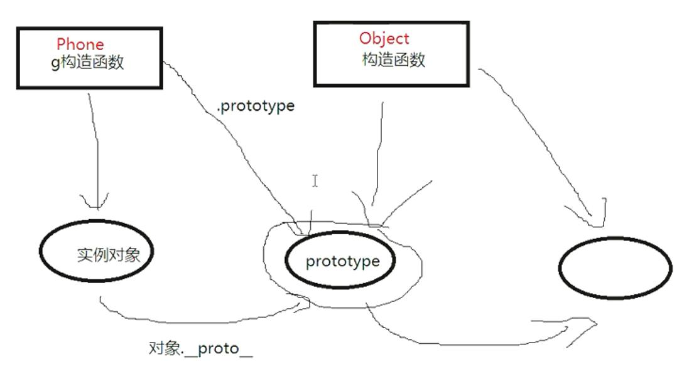

## 面试题总结

#### 01 面试对象编程与面向过程编程的区别

```
面向过程：  顺序


面向对象： （核心思维方式） 找到角色，确定职责

class 视频播放组件 {
	点赞()
	评论（）
}
```

#### 02 this 指向问题 ？？？？？？？？？？

```
this 指向是 【当前对象】所谓当前对象，是指，此刻正在执行这个函数的对象
谁调用这个函数， this就指向谁
```

#### 03 普通函数和箭头函数的区别

```
普通函数
const test = function() {

}

箭头函数
const  test = () => {

}

对象
let obj = {
	id: 99,
	hello: () => {
		console.log(this) //  当箭头函数不存在  指向全局window
		console.log(this.id);   // undefined
	}
	print: function (){
		console.log(this.id);  // 指向obj
		setTimeout(function() {  --------------     换成箭头函数  this --- id99
			console.log(this.id);   // undefined
			console.log(this, 'this')   // 函数嵌套函数 window
		}, 300)
	}
}

obj.hell();

obj.print();

```

```
1.没有this，箭头函数没有this，需要通过作用域确定this值

如果箭头函数被普通函数包含，this绑定的是最近一层普通函数的this，因为没有this,不能用bind()、call()、apply()改变this指向

2.没有arguments
箭头函数没有自己arguments对象，因为箭头函数可以访问外围函数的arguments对象
function constant(){
	return () => arguments[0]
}
var res = constant(1);
console.log(result());  //1

3.不能通过new关键字调动

箭头函数没有constructor 方法，不能被用作箭头函数，用new方式调用，会报错
var Foo = () => {};
var foo = new Foo();  //TypeError: Foo is not a constructor


4.没有new.target
因为不能使用new调用，所以也没有new.target值

5.没有原型
由于不能使用new调用箭头函数，于是箭头函数也不存在prototype这个属性。
```

#### 04 eval 函数作用？ ？？？？？？？？、

```
严格模式下 eval 有自己的作用域
```

#### 05 函数节流和函数防抖 柯里化函数

```
函数防抖: 页面 滚动在短时间内不会频发触发，  固定时间内，只有最后一次生效  输入框搜索自动补全事件，频繁操作点赞和取消点赞等等
射击游戏的 mousedown/keydown 事件（单位时间只能发射一颗子弹

function debounce(callback, delay = 300) {
	var t = null;
	return function (e) {
		clearTimeout(t);
		t = setTimeout( () => {
			callback.call(e);
		}, delay);
	}
}

 window.onscroll = debounce(function (){  // 滚动事件
	 console.log('调用了一次');
 }, 500);
简单解释： 页面滚动 ，延迟500ms,没有等到500ms马上触发第二次，次数频繁，上一次被销毁
依次类推 ， 依照最新的为准


函数节流：   单位时间内   只有一次 	(就是指连续触发事件但是在 n 秒中只执行一次函数。 节流会稀释函数的执行频率)
解释： 触发一个函数，时间间隔500ms，  没到500ms ，找到时间节点对比。 超过500，记录一次
不超过，不做记录

function throttle(callback, duration){
	var lasttime = new Date().getTime();  // 上一次 时间
	return function () {
		var now = new Date().getTime();   // 当前时间
		if(now - lasttime > 500) {
			callback(),
			lasttime = now;  // 更新时间
		}
	}
}

window.onscroll = throttle(function () {
		console.log('调用了1次');
}, 500)


```

#### 06 柯里化函数 ???

```
函数的多参变成单参数（ 形成闭包）

fn（2，3，4） -------- 变成 fn（2）（3）（3） == 24；

// 多参数
function fn (a, b, c) {
	return a * b *c;
}

// 单参数  典型闭包
function fn(a){
	return function (b){
		return function (c){
			return a *b *c;
		}
	}
}

用处：


多参调用 fn(1, 3, 4);
		fn(1, 4, 5);
		fn(1,5, 6);

单参 : 简化了函数的调用

let ft = fn(1);
ft(3, 4);
ft(4,5);

```

#### 07 作用域链是什么

```
window；  全局作用域对象
var num = 99;
function test(){
	var num = 0;
	function mc () {
		var num = 100;
		console.log(num);
	}
	mc();
}

test();  //  依次向上查找执行，查找到便不再执行，  100
```

#### 08 原型链继承的机制是什么（js 的默认继承是什么）

```
call（）
apply（）
prototype（默认继承）

function Phone(){

}
Phone.prototype = new Object();
new Phone().tostring();
Phone.prototype.__proto__  === Object.prototype;

var obj = {}     //  ===  new Object();


Object构造函数顶层是null   ----------  new Object().__proto__.__proto__ = null

```




#### 09 垃圾回收机制

##### 垃圾回收

[](https://segmentfault.com/a/1190000018605776?utm_source=tag-newest#item-1)

```
Js中的内存管理是自动执行的，而且是不可见的，我们创建基本类型、对象、函数所有这些都需要内存。
当我们不再需要某样东西发生什么？js引擎如何发现并且处理呢
```

**面试如何对打**
1） 什么是垃圾

```
一般来说没有被引用的对象就是垃圾，就是要被清除，有个例外对象如果引用形成一个环，互相引用，但根访问不到他们，这几个对象也是垃圾，需要被清除。
```

2. 如何检测垃圾

```
标记-清除法
1. 垃圾回收器获取根并标记记住他们
2.然后它访问标记所有来自她们的应用
3.然后它访问标记对象并标记他们的引用，所有被访问的对象都被记住，以便以后不再访问同一个对象两次
4.以此类推，直到有未访问的引用可以从根访问为止
5.除标记的对象外，所有对象都被删除。
```

#### 10 Promise

```
Promise是异步编程的解决方案
处理了之前函数回调地狱问题

Promise对象是一个构造函数，用来生成Promise实例
const promise = new Promise(function(reslove, reject){
	// code
	if(异步操作成功){
		resolve(value)
	} else {
		reject( error);
	}
});


```

async 和 await

1. 理解

- 简化 promise 的使用，不再使用 then()指定回调函数
- 能同步编码方式实现异步流程

2. 使用

- 哪里使用 await，在返回 promise 对象表达式的左侧，左侧得到不再是 promise，而是 promise 异步成功的结果
- 哪里使用 async await 所在函数定义的左侧
-

#### 11 Map， flatMap reduce

```
Map使用

let arr = [1,2,3,4,5];
let arr1 = arr.map(function(item,index, arr) {
	console.log(item,index, arr)
})

1 0 [1, 2, 3, 4, 5]
2 1 [1, 2, 3, 4, 5]
3 2 [1, 2, 3, 4, 5]
4 3 [1, 2, 3, 4, 5]
5 4 [1, 2, 3, 4, 5]

返回： item 当前元素， index 当前元素索引 arr被调用数组

通过map遍历的数据形成新数组，与原数组之间是没有关系的
map遍历返回数组长度和原数组是完全相等的，

```

```
flatMap  多维降一维， 默认是二维降成一维

let arr = [1,2,3,4,5];
let arr1 = arr.flatMap((item, index, arr) => {
	return [item, item *2]
})
console.log(arr1);

// 将维度处理 [1, 2, 2, 4, 3, 6, 4, 8, 5, 10]
改变数组长度 arr2 大于arr

```

#### 12 深拷贝是什么？ 项目哪里用到深拷贝

```
浅复制： 可以将对象最外层属性全部复制，里层属性仍然是引用关系

let obj = {a:1, b: 2, c: {d:3, e:8}};
let obj1 = {};

//Object.assign(obj1, obj)   第一种方法

for(item in obj){         // 第二种方法遍历 对象
	obj1[item] = obj[item]
}

console.log(obj1); // {a:1, b: 2, c: {d:3, e:8}};


```

```
深拷贝
JSON.parse(JSON.stringify(obj))  缺陷： 无法复制不可遍历对象 set， get


// 全能深拷贝
优点： 完成所有不可遍历属性，set get方法，

var obj = {a:1, b:2, c:{d:10, e:20}};
var obj1 = {};

cloneObject(obj1, obj)
target: 目标
source： 源文件


var obj = {
    a:1,
    b:2,
    c:
    {d:10, e:20},
    set f(value){
        this.a=value;
    },
    get f(){
        return this.a;
    }
    };
var obj1 = {};

cloneObject(obj1,obj);
        var obj = {
            a: 1,
            b: 2,
            c: {
                d: 10,
                e: 20,
                set f(value) {
                    this.a = value;
                },
                get f() {
                    return this.a;
                }
            },
            set f(value) {
                this.a = value;
            },
            get f() {
                return this.a;
            }
        };
        var obj1 = {};

        cloneObject(obj1, obj);
        console.log(obj1);

// 深克隆  target： 目标， source： 源文件
        function cloneObject(target, source) {
            // 获取对象下的所有属性，包括不可遍历属性
            // 获取source 所有属性名
            var names = Object.getOwnPropertyNames(source);
            //    console.log(names, 'names');
            for (var i = 0; i < names.length; i++) {
                //获取所有的对象
                var desc = Object.getOwnPropertyDescriptor(source, names[i]);
                // console.log(desc);
                if (typeof (desc.value)==="object" && desc.value !== null) {
                    // 值为对象的时候
                    var obj;
                    if (Array.isArray(desc.value)) {
                        obj = [];
                    } else {
                        obj = {};
                    }
                    Object.defineProperty(target, names[i], {
                        value: obj,
                        writable: desc.writable,
                        enumerable: desc.enumerable,
                        configurable: desc.configurable,
                    });
                    //递归
                    cloneObject(obj, desc.value)
                } else {
                    Object.defineProperty(target, names[i], desc);
                }
            }
        }


打印结果：
Object
f: (...)
a: 1
b: 2
c: {d: 10, e: 20}
get f: ƒ f()
set f: ƒ f(value)
__proto__: Object

value: 1
writable: true
enumerable: true
configurable: true

```

#### 13 了解 ES6 的 Proxy

#### 14 事件循环 EventLoop

#### 15$(window).load  与$(window).ready 区别

## 框架总结

### 01. React 与 Vue 区别与联系

```
渲染用户界面，DOM操作效率低
尽量减少DOM操作， Vue和React都是用虚拟DOM实现，

相同点：
	 1. 都支持服务端渲染（seo优化，支持爬虫）
	 2. 使用虚拟DOM实现
	 3. 组件式开发
	 4. 框架的骨架，其他主体功能分离，比如路由，状态管理
	 5. 数据驱动视图
	 6.支持native原生方案， React ---- native， Vue---weex


不同点：
		1.React渲染功能是JSX，Vue是Template写模板
		2.性能： React机制触发整个组件重新呈现，大量的检查机制，提供许多有用的警告提示信息
		Vue提供优化的重新渲染，系统在渲染过程中跟踪依赖关系并相应工作
		3. React针对MVC， Vue 是MVVM模式
		4.虚拟dom，vue会跟踪每一个组件的依赖关系，不需要重新渲染整个组件树
		5.react每当应用状态全部改变，都会重新渲染，需要使用shouldComponentUpdate这个生命周期控制
		6.react ---- all in js
		7.vue实现双向数据绑定，react数据流向单向


```

sunnie0918

### 02 前后端协作问题综合

### 03 跨域综合

01 线上解决方案(CORs)：Allow-access-origin： '\*'----

普通跨域请求： 服务端设置 Access-Control-Allow-Origin，，如果带 cookie，前后端都需要设置
（xhr.withCredentials = true;）

### 04.jsonp

本地解决： proxy---- webpack-dev-server
sonp 原理（仅支持 get 请求）

```
原生实现：
<script>
// 设置script 标签
var script = document.createElement('script');
script.type = 'text/javascript';

// 传递一个回调函数名给后端，方便后端返回时执行这个在前端定义的回调函数
script.src = 'http://www.domain2.com:8080/login?user=admin&callback=handleCallback';
document.head.appendChild(script);

// 回调执行函数
function handleCallback(res){
	alert(JSON.string(res));
}
</script>

服务端返回如下（返回时即执行全局函数）
handleCallback({"status": true, "user": "admin"})
```

## react

#### 1. react 虚拟 dom 是怎么回事

虚拟 dom 是真实 DOM 在内存中的表示。
虚拟 dom 相当于在 js 和真实 dom 之间加入一个缓存，利用 diff 算法避免没有必要的操作

- 用 js 对象结构表示 dom 树的结构，然后利用这个树构建一个真正的 dom 树，插入到文档中
- 当状态变更的时候，重新构建一颗新的对象树，然后用新树和旧树对比，记录差异
- 把记录到的差异应用到真正的 dom 数，视图更新
- 把树形结构按照层级分解，之比较同级元素

```
 tree diff ---------新旧dom对比，逐层对比的过程就是tree，当整个DOM对比完毕，需要的元素必然能够找到
 componment diff  ----------  组件级别的对比 叫做Componment diff 1.如果对比前后组件类型相同，不需要被更新，如果不同，则需要移除不同的旧组件，创建新组件，追加到页面上
 element diff  -------   类型标签级别对比， 组件类型相同，需要进行元素级别对比

```

```
优点：
	保证性能下限： 虚拟DOM可以经过diff找出最小差异，然后批量进行patch
	无需手动操作DOM，虚拟DOM的diff和path都是在一次更新中自动进行
	跨平台，虚拟dom本质是js对象，例如服务端渲染，移动端开发
缺点： 无法进行极致优化
```

#### 2. react-router 的原理

#### 3. react 最新的生命周期

react16 之后有三个生命周期被废弃（没有被删除）

- componmentWillMount
- componmentWillReceiveProps
- componmentWillUpdate
  官方计划在 17 版本中完全删除，只保留 UNSAVAE\_前缀的三个函数，目的是为了向下兼容，

React16.8 ---- 挂载阶段 更新阶段 卸载阶段

**挂载阶段**

- constructor：构造函数，最先被执行，我们通常在构造函数里初始化 state，或者给自定义的方法绑定 this
- getDerivedStateFromProps（static getDerivedFromProps(nextProps, prevState))静态方法，当我们接收到新的属性想去修改 state 时候，可以使用 getDerivedStateFromProps0
- render：纯函数，只返回需要渲染的东西，不应该包含其他的业务逻辑，可以返回原生的 DOM，React 组件，Fragment，字符串和数字 Boolean 和 null 内容
- componmentDidMount 组件挂载调用，此时可以获取到 DOM 节点，比如对 canval 操作，服务器请求，有订阅需要在 componmentWillUNmount 取消订阅

**更新阶段**

- getDeverivedStateFromProps， 挂载和更新阶段都可能给调用到
- shouldComponmentUdate: shouldComponmentUpdate(nextProps, nextState),有两个参数 nextProps 和 nextState，表示新的属性和变化之后的 state
  返回一个布尔值，true 表示触发重新渲染，false 表示不会触发重新渲染，默认返回 true，优化 react 性能
- render： 更新阶段会触发此生命周期
- getSnapshotBeforeUpdate： getSnapBeforeUpdate(prevProps, prevState)这个方法在 render 之后，componmentDidUpdate 之前调用，会最为第三个参数传给 componentDidUpdate，如果不想要返回值，可以返回 null 值，此生命周期必须和 componmentDidMount 搭配使用
- componmentDidUpdate： componmentDidUpDate(prevProps,prevState, snapshot),表示之前的 props，之前的 state，和 snapshot，如果触发某些回调函数需要用到 DOM 元素的状态，则对比或计算的过程迁移至 getSnapBeforeUpdate，然后在更新中统一触发回调或更新状态

**卸载阶段**

- componmentWillUnmount 当我们的组件被卸载或者销毁了之后就会被调用，去除定时器，取消网络请求清理无效的 DOM 元素到垃圾清理工作

#### 4.react 请求应该放在哪个生命周期中

官方推荐的异步请求应该是在 componmentDidMount 中
react 17 之后 componmentWillMount 将被废弃，仅仅保留 UNSAFE_componment

#### 5. setState 到底是异步还是同步

```
有时表现为同步，有时候是异步
setState(updater, callbakc)告诉react组件数据有更新，有可能需要重新渲染
,react 通常集齐一批需要更新的组件，然后一次性更新来保证性能

setState生命周期异步
在原生事件中是同步的

```

- setState 只在合成事件和钩子函数中是“异步”的，在原生事件和 setTimeout  中都是同步的。
- setState  的“异步”并不是说内部由异步代码实现，其实本身执行的过程和代码都是同步的，只是合成事件和钩子函数的调用顺序在更新之前，
  导致在合成事件和钩子函数中没法立马拿到更新后的值，形成了所谓的“异步”，当然可以通过第二个参数  setState(partialState, callback)  中的 callback 拿到更新后的结果。
- setState  的批量更新优化也是建立在“异步”（合成事件、钩子函数）之上的，在原生事件和 setTimeout 中不会批量更新，在“异步”中如果对同一个值进行多次 setState，setState 的批量更新策略会对其进行覆盖，取最后一次的执行，如果是同时 setState 多个不同的值，在更新时会对其进行合并批量更新。

#### 6. React 的生命周期函数中，当 props 改变的时候 会引发的后续变化， render（）函数什么时候执行

render 函数第一次执行的时候会将渲染的数据在内存中保存一份，当第二次数据发生了改变后，render 会将这次的虚拟 DOM 与缓存中的虚拟 DOM 进行对比 这种对比叫做 DIFF 算法

#### 7. redux 数据流通的过程

**1.概念**
数据管理中心，相当于一个全局的 data store 实例

- Store： 保存数据的地方，整个应用只能有一个 store
- State： Store 对象包含所有的数据，如果想要的得到某个时点的数据，就要对 Store 生成快照，数据集合
- Action：Action 是 View 发出的通知，表示 State 要变化了
- Action Creator： View 要要发送多少种消息，就要多少种 Action，函数就叫做 Action Creator
- Reducer ： Store 收到 Action 后， 必须给出一个新的 State，View 才变化，过程叫做 Reducer
- Reducer 是一个函数，接受 Action 和当前的 State 作为参数，返回一个新的 State
- dispatch： 是 view 发出 action 的方法

**工作流程**：

- 用户通过 view 发出 Action，调用 dispatch 方法
- 然后 Store 自动调用 Reducer 方法,并且传入两个参数，当前 State 和 Action，Reducer 返回新的 state
- State 一旦有变化，Store 就会调用监听函数，更新 View


#### 8. react 的 diff 算法

- 给列表结构中的每个单元添加唯一的 key 属性，方便比较
- React 只会匹配相同的 class（组件名字）的 componment
- 合并操作，调用 componment 的 setState 方法，React 将其标记为 dirty 到每一个事件循环结束，React 检查所有标记 dirty 的 componment 重新绘制
- 选择性子树渲染，开发人员可以重写 shouldComponmentUpdate 提高 diff 性能

#### 9. 类组件和函数组件的区别？

- 类组件可以使用 state 和生命周期钩子
- 当组件接受 props 渲染到页面时候，是无状态组件函数组件
- 性能方面，类组件需要实例化，而函数组价执行函数返回结果就可以

**类组件缺陷**

- this 指向容易错误
- 分割在不同声明周期中的逻辑使得代码难以理解和维护
- 代码复用成本高（高阶组件容易使代码量剧增）

**react hooks 缺陷**

- 额外的学习成本（Functional Component 与 Class Component 之间的困惑）
- 写法上有限制（不能出现在条件、循环中），并且写法限制增加了重构成本
- 破坏了 PureComponent、React.memo 浅比较的性能优化效果（为了取最新的 props 和 state，每次 render()都要重新创建事件处函数）
- 在闭包场景可能会引用到旧的 state、props 值
- 内部实现上不直观（依赖一份可变的全局状态，不再那么“纯”）
- React.memo 并不能完全替代 shouldComponentUpdate（因为拿不到 state change，只针对 props change）

#### 10. react 高阶组件

高阶组件 Hoc 接受一个组件并返回一个新组件的函数，是从 react 组合特性衍生出来的，称其为纯组件
因为他们可以接受任何动态提供的子组件，但不会修改或复制输入组件中的任何行为

用例：

- 代码重用逻辑和引导抽象
- 渲染劫持
- state 抽象和操作
- props 处理

#### 11. 使用 hooks 好处

- 支持提取和重用多个组件的通用的有状态的逻辑，
- 无需承担高阶组件和渲染 props 的负担
- 对比 componentDidMount、componentDidUpdate、componentWillUnmount，使用一个 useEffect 可以解决

#### 12.受控组件和非受控组件

react 中，表单元素（<input><select><checkbox>）通常维护自己的 state，将 state 赋值给 value 属性，并根据用户输入 setState()更新 state,以这种方式控制表单元素称为“受控组件”
**（1）受控组件**
受控组件中，state 作为组件"唯一数据源"，组件控制着用户
操作过程中表单发生的操作。

```
class CreateForm extends React.Component {
	constuctor(props){
		super(props)
		this.state = {
			name: ''
		}
	}
}

nameChange = (evevt) => { // 接受事件作为参数
	this.setState({
		name: event.target.value
	})
}
render () {
	const {name} = this.props;
	return (
	<div>
		<input value={name} onChange={this.nameChange} />
		<div>name: {name}</>
	</div>
	)
}
```

**(2)非受控组件**
在 react 中，对于不能使用 state 方式管理的表单组件称之为
`非受控组件`，非受控组件的值不能通过代码控制，表单数据
交由 DOM 处理。对于非受控组件，可以使用 ref 从 dom 节点中获取表单数据

`<input type="flie" />`始终是一个非受控组件，通过创建 ref 的形式获取文件数据

```
class CreateForm extends React.Component {
	constructor(props){
		super(props)
		this.fileRef = React.createRef(null)
	}
	//方法
	fileChange = (event) => {
		event.preventDefault();
		const file = this.fileRef.current.files[0];
		console.log(file);
	}
	render() {
		return (
		<div>
			<input type="file" ref={this.fileRef}
			onChange={this.fileChange} /}
		</div>
		)
	}
}
```

# js

#### 2. js 如何创建一个对象

`[创建对象](https://www.cnblogs.com/nxmxl/p/11696781.html)`

```
方法一： 原始方法
var obj  = new Object();
obj.name = 'ck';  为对象添加属性
obj.showName = function(){
	console.log(this.name)
}

方法二： 工厂方法

function createObj(name){
	var obj = new Object();
	obj.name = name;
	ojb.showName = showName;
	return obj;
}
var obj1 = new createObj('ck');
var obj2 = new createObj('ks');

obj1.showName(); // ck
obb2.showName(); ks

方法三： 构造函数方法

function Person(name, age){
	this.name = name;
	this.age = age;
	this.showName = function(){
		console.log(this.name);
	};
	this.showAge = function(){
		console.log(this.age);
	}
}
var obj1 = new Person('kc', '21');
var obj2 = new Person('kk', '23');
obj1.showName(); 'kc';


方法四：
function Person(){} //定义一个空构造函数，且不能传递参数
//将所有的属性的方法都赋予prototype
Person.prototype.name = "Kitty";
Person.prototype.age = 21;
Person.prototype.showName = function (){
console.log(this.name);
};
Person.prototype.showAge = function (){
console.log(this.age);
};

var obj1 = new Person("Kitty","21");
var obj2 = new Person("Luo","22");

obj1.showName();//Kitty
obj1.showAge();//21

obj2.showName();//luo
obj2.showAge();//22
```

#### 3. 如何清除浮动

问题：解决父元素因为子级元素浮动引起的内部高度为 0 的问题

**方法一 额外标签**

```
最后一个浮动标签后加入一个新的标签，比如div，设置clear：both;
缺点，添加了无意义标签
```

**方法二 父级添加 overflow 属性**

```
触发kfc 实现清除浮动
.father {
	width: 400px;
	border: 1px solid pink;
	overflow: hidden;
}

缺点： 内容多的时候造成不会自动换行的内容被隐藏掉
```

**方法三 使用 after 伪元素清除浮动**

```
.clearfix: after{  伪元素是行内元素，正常浏览器清除浮动方法
content: '';
display: block;
height: 0;
clear: both;
visibility: hidden;
}
.clearfix{
	*zoom: 1;    //兼容id
}

<div class="father clearfix">
	<div class="box0">box0</div>
	<div class="box1">box1</div>
</div>
<div class="footer"></div>
```

**方法四 使用 before 和 after 双伪元素清除浮动**

```
     .clearfix:after,.clearfix:before{
        content: "";
        display: table;
    }
    .clearfix:after{
        clear: both;
    }
    .clearfix{
        *zoom: 1;
    }

 <div class="fahter clearfix">
       <div class="box0">box0</div>
       <div class="box1">box1</div>
    </div>
 <div class="footer"></div>
```

#### 4. 如何想让一个元素在页面看不见

```
display="block"  ----- display="none" 不占有位置隐藏时候
visiibility="visiible" ------  visibility="hidden"  隐藏占位
```

#### 6. 盒模型

margin 外边距 + border 边框 + padding 内边框 + 内容
不同之处就是标准盒模型的内容大小就是 content 的大小，而 IE 的则是 content + padding +border 总的大小

#### 7. 页面中的性能优化

#### 8. 如何解决跨域的，jsonp 有什么缺点

jsonp 支持 get 请求，脚本注入有安全隐患

#### 9. 如果你接到一个项目如何从头开始的(需求，技术选型，技术环境，依赖哪些组件)

Webpack + react 全栈

**工程架构**

- webpack 配置
- node 服务
- 服务端渲染

**项目架构**

- react
- React-Router 配置
- Mobox 配置
- 服务端渲染优化

**业务开发**

- 页面开发
- 登录服务
- 服务端渲染优化

**项目部署**

- PM2
- Nginx

10. js 的继承（口述代码）
11. 闭包（闭包有什么缺点）
    函数 A 里面包含了函数 B，而函数 B 里面使用了函数 A 的变量，称之为闭包

```
function A(){
	var a = 1;
	function B(){
		console.log(a);
	}
}
A();
```

**闭包特征**

- 函数内嵌套函数
- 内部函数可以引用外层的参数和变量
- 参数和变量不会被垃圾回收机制回收

**闭包理解优点**

- 使用闭包主要是为了设计私有方法和变量
- 读取函数内部的变量，让这些变量始终在内存中

**缺点**

- 消耗内存
- 不正当使用造成内存溢出问题（解决方法在退出函数前，将不使用的局部变量全部删除）

###12. js 的作用域有哪些
###13. 安全隐患

###1. 自己对 react 的理解，  
###2. 虚拟 dom 实现的原理以及怎么实现，
###3. 跨域，
###4. 还有怎么创建一个类，

###5. get 和 post 的区别，

```
 GET：一般用于信息获取，使用 URL 传递参数，对所发送信息的数量也有限制，一般在 2000 个字符                POST：一般用于修改服务器上的资源，对所发送的信息没有限制  
在以下情况中，请使用 POST 请求： 1. 无法使用缓存文件（更新服务器上的文件或数据库） 2. 向服务器发送大量数据（POST 没有数据量限制） 3. 发送包含未知字符的用户输入时，POST 比 GET 更稳定也更可靠
实际上HTTP 协议从未规定 GET/POST 的请求长度限制是多少。对get请求参数的限制是来源与浏览器或web服务器，浏览器或web服务器限制了url的长度。为了明确这个概念，我们必须再次强调下面几点:
1、HTTP 协议 未规定 GET 和POST的长度限制
2、GET的最大长度显示是因为 浏览器和 web服务器限制了 URI的长度
3、不同的浏览器和WEB服务器，限制的最大长度不一样
4、要支持IE，则最大长度为2083byte，若只支持Chrome，则最大长度 8182byte
```

6. 自己的优缺点
7. v-if 和 v-show 的区别
8. 箭头函数和普通函数的区别，
   箭头函数的 this 指向规则，
   **1.箭头函数没有 prototype 原型，所以箭头函数本身没有 this**

```
let a = () => {};
console.log(a.prototype);   undefined;
```

**2. 箭头函数的 this 指向在定义的时候继承自外层第一个普通函数的 this**
[](https://juejin.im/post/5c76972af265da2dc4538b64)

5. ES6 的常用语法 ES7 中的新语法

6. react 和 vue 的区别

7. http 请求流程

8) 做过哪些实际上的优化
   React 在语法层面可以做哪些性能优化？

10. 怎样处理版本分支

#### 10. 为什么选择使用框架而不是原生

```
框架的好处
1. 组件化，react组件化更为彻底，到达函数级别的原子组件
2. 操作dom，性能低，而通过操作虚拟dom，提升性能
3. 生态，主流框架自带生态，不管事数据流架构还是UI库都有成熟的解决方案

```

### 11. 如何把一个字符串的大小写取反，aBC ---- Abc

```
let str = 'sfsfdfgdfgGDFGDF';

str = str.replace(/[a-zA-Z]/g, (content) => {
  return content.toUpperCase() === content ? content.toLowerCase(): content.toUpperCase();
})
console.log(str);
```
